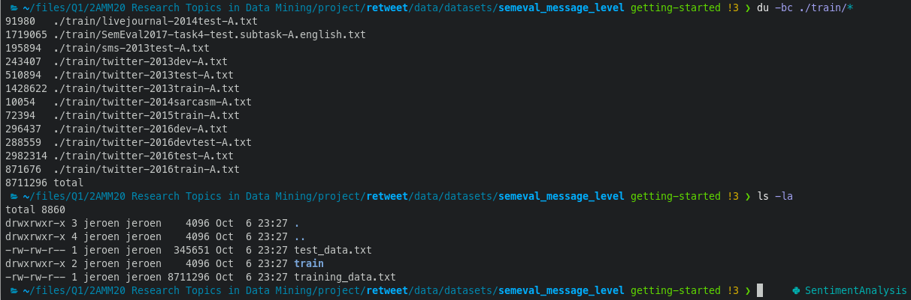

# Some quick notes

## Data

It seems that the file `data/datasets/semeval_message_level/training_data.txt` has been constructed by concatenating all the files in the directory `data/datasets/semeval_message_level/train/`, because their sizes sum to the exact size of the training data file:

# Downloading Pretrained GloVe model

The folder `.vector_cache` is generated by `torchtext`, see [the documentation](https://torchtext.readthedocs.io/en/latest/vocab.html). When you start training for the first time, you may see that the pretrained word embedding configured in the default `config.json` is downloaded first. Apparently, this particular pretrained embedding based on Twitter tweets is so common that it is [supported by default in torchtext](https://torchtext.readthedocs.io/en/latest/vocab.html#glove).
